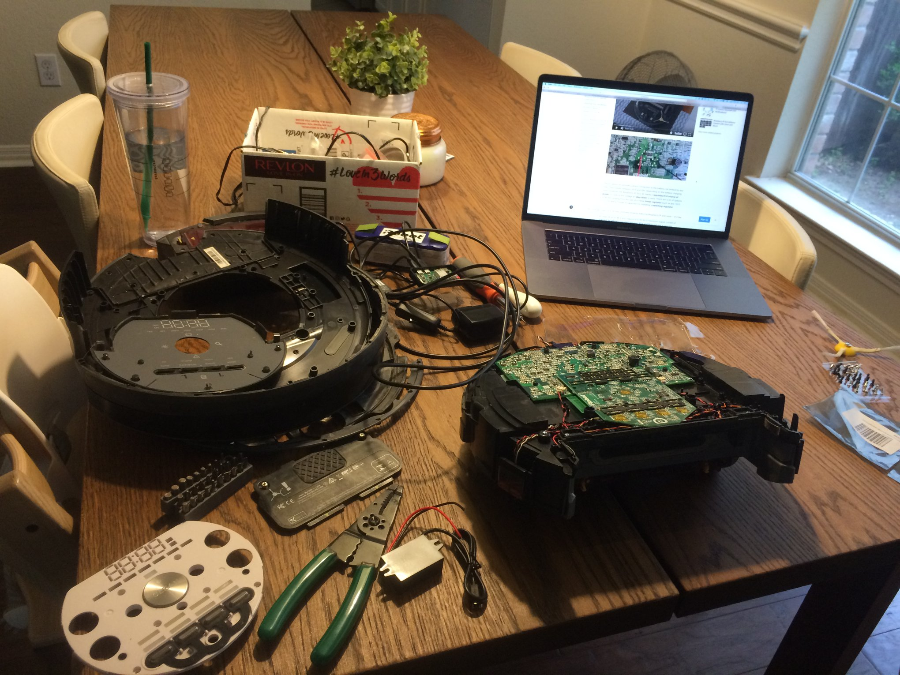
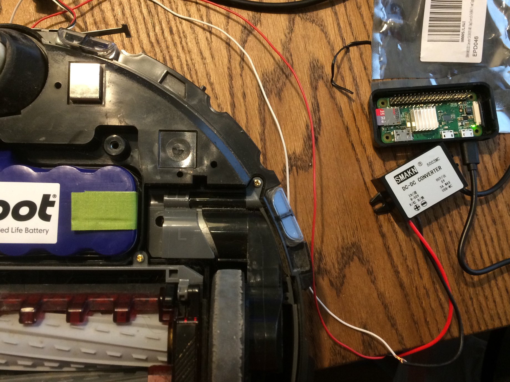
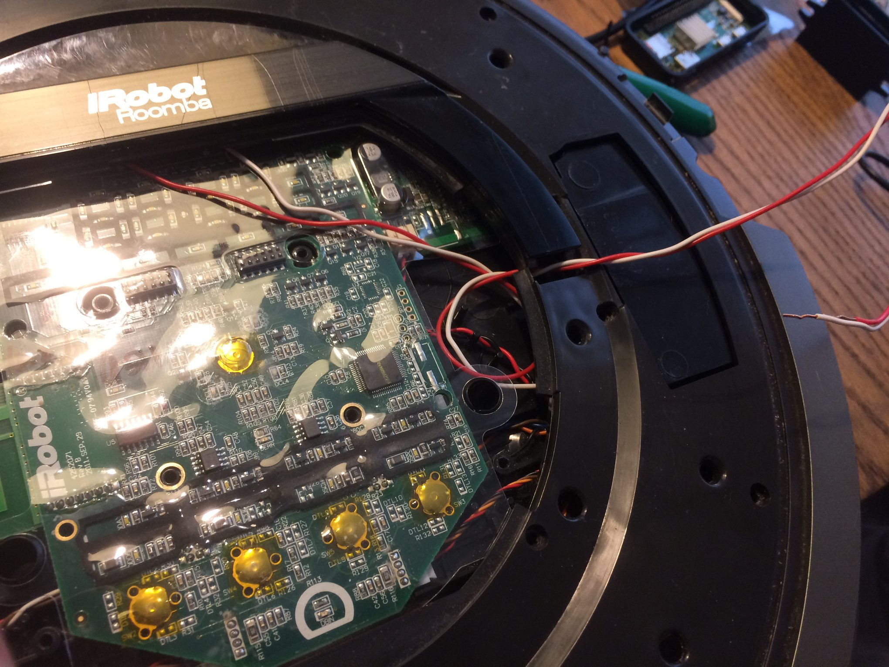
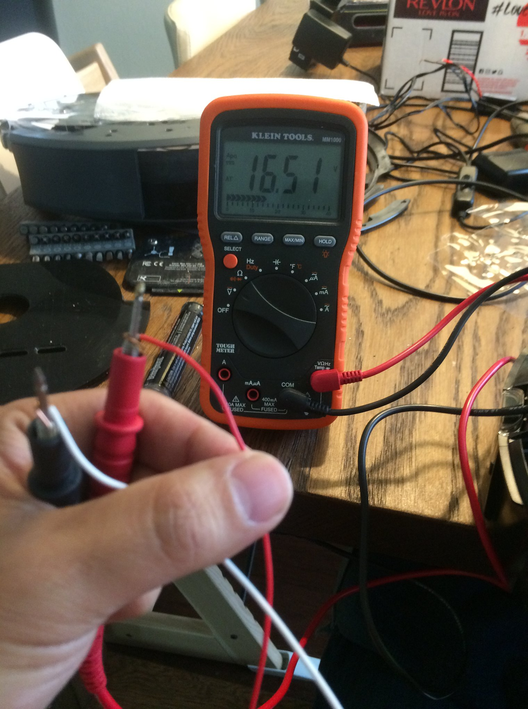
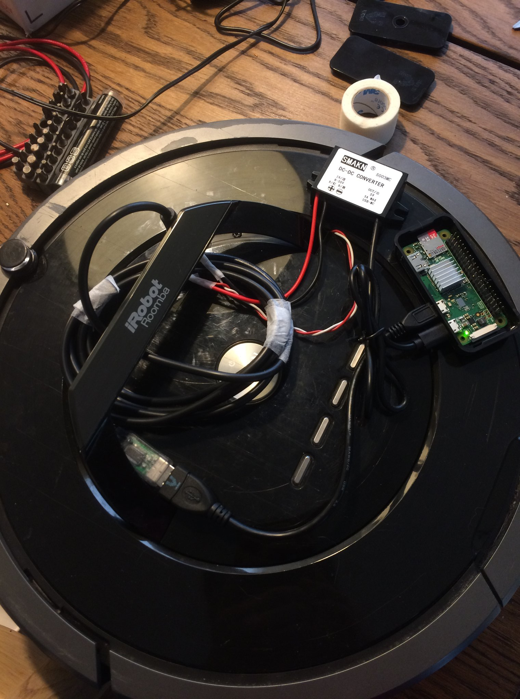
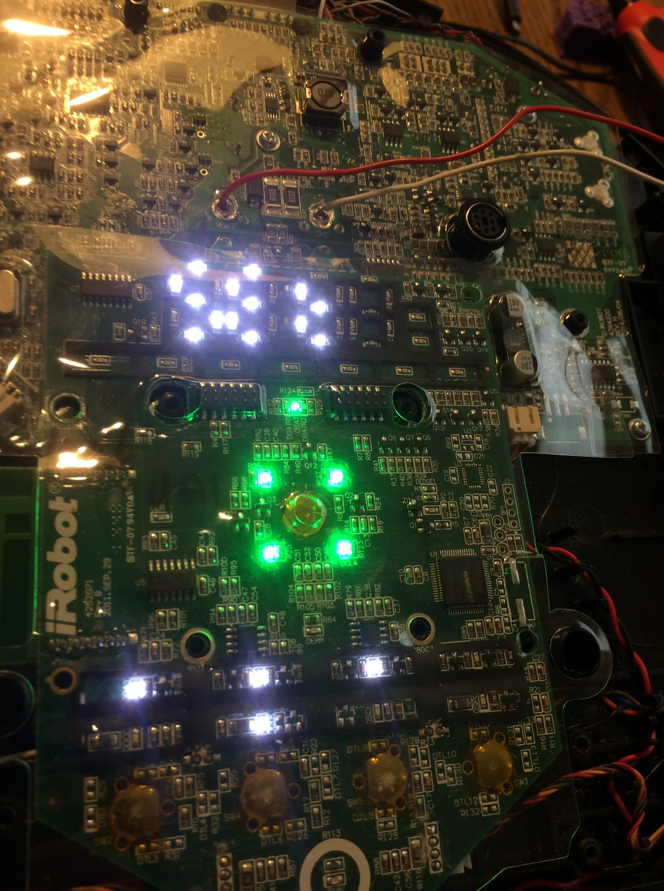

# Hardware Setup Guide - Alexa Roomba Control

## Overview
This guide provides step-by-step instructions for assembling the hardware to control an iRobot Roomba 880 using voice commands via Amazon Echo and a Raspberry Pi Zero W.

**What you'll build:** A self-contained system where the Raspberry Pi sits inside your Roomba, powered by the Roomba's own battery, enabling wireless voice control.

---

## Table of Contents
1. [Hardware Components](#hardware-components)
2. [Tools Required](#tools-required)
3. [Step-by-Step Assembly](#step-by-step-assembly)
4. [Wiring Diagrams](#wiring-diagrams)
5. [Testing & Validation](#testing--validation)
6. [Troubleshooting](#troubleshooting)

---

## Hardware Components

### Required Components

| Component | Specification | Approx. Cost | Purpose |
|-----------|--------------|--------------|---------|
| **Roomba** | iRobot Roomba 800 series (880 shown) | $200-400 | Robot vacuum to be controlled |
| **Raspberry Pi** | Raspberry Pi Zero W | $10-15 | Main controller with WiFi |
| **DC-DC Converter** | SMAKN 5V Step-Down (14.4V → 5V, 1A+) | $8-12 | Powers Pi from Roomba battery |
| **USB-to-Serial Cable** | FTDI USB-to-Serial, 3.3V logic | $8-12 | Serial communication |
| **Wires** | 22 AWG, Red/Black pair | $5 | Power connections |
| **Amazon Echo** | Any Echo device | $25-100 | Voice control interface |

### Optional but Recommended
- Heat shrink tubing or electrical tape
- Velcro strips or double-sided foam tape
- Wire connectors (JST or similar)
- Multimeter for voltage testing

---

## Tools Required

- Soldering iron and solder
- Wire strippers/cutters
- Multimeter (essential for safety!)
- Small Phillips screwdriver
- Hot glue gun (optional, for securing components)

---

## Step-by-Step Assembly

### Step 1: Workspace Setup



*A clean, well-lit workspace with all components laid out*

**Before you begin:**
1. Ensure Roomba battery is charged
2. Lay out all components
3. Have your multimeter ready for testing
4. Work on a non-conductive surface

---

### Step 2: Understanding the Battery Connection



*Key components: Roomba battery (left), DC-DC converter (SMAKN, center-right), Raspberry Pi Zero W (right)*

The Roomba 880 uses a **14.4V lithium-ion battery**. We'll tap into this to power the Raspberry Pi through a voltage converter.

**Important Safety Notes:**
- ⚠️ Always verify voltage before connecting to Pi
- ⚠️ Never short the battery terminals
- ⚠️ Disconnect battery when soldering

---

### Step 3: Locate Battery Connection Points



*Roomba's main PCB showing battery connection points (red and black wires already soldered)*

**Battery tap locations on Roomba PCB:**
- **Red wire (+)**: Solder to positive battery terminal pad
- **Black wire (-)**: Solder to ground terminal pad

**Soldering tips:**
1. Remove the Roomba's top cover and cargo bay handle
2. Locate the battery connector on the main PCB
3. Identify the positive and negative pads (marked on PCB)
4. Use 22 AWG wires, approximately 6-8 inches long
5. Solder carefully - these pads carry high current
6. Insulate connections with heat shrink tubing

---

### Step 4: Verify Battery Voltage



*Testing battery voltage with multimeter - shows 16.51V (fully charged)*

**Critical voltage check:**
```
Expected voltage range:
- Fully charged: 16.0-16.8V
- Normal operation: 14.0-16.0V
- Low battery: 12.0-14.0V
```

**Testing procedure:**
1. Set multimeter to DC voltage mode (20V range)
2. Touch red probe to red wire (positive)
3. Touch black probe to black wire (negative)
4. Verify voltage is between 14-17V
5. **DO NOT PROCEED** if voltage is outside this range

---

### Step 5: Connect DC-DC Converter

The DC-DC converter steps down the Roomba's 14.4V to the 5V required by the Raspberry Pi.

**Connection steps:**
1. **Input side (14.4V)**:
   - Connect red wire from battery to IN+ terminal
   - Connect black wire from battery to IN- terminal

2. **Adjust output voltage**:
   - Use multimeter to measure OUTPUT terminals
   - Adjust the potentiometer (small screw on converter)
   - Set output to **exactly 5.0V** (±0.1V)
   - ⚠️ **This is critical! Too high will damage your Pi!**

3. **Output side (5V)**:
   - Prepare wires for Pi connection
   - Red wire goes to Pi 5V power
   - Black wire goes to Pi GND

**DC-DC Converter Wiring:**
```
Battery (14.4V)                     Raspberry Pi
    │                                    │
    ├─ Red (+) ──→ IN+                  │
    │               │                    │
    │          [DC-DC Converter]         │
    │          (SMAKN 5V 1A)            │
    │               │                    │
    └─ Black (─) ─→ IN─   OUT+ ──→ Red (+5V) ──→ GPIO Pin 2
                           OUT─ ──→ Black (GND) ──→ GPIO Pin 6
```

---

### Step 6: Mount Components Inside Roomba



*Fully assembled system showing all components installed inside Roomba*

**Component placement:**
1. **DC-DC Converter**: Mount near battery compartment using double-sided tape
2. **Raspberry Pi Zero W**: Install in cargo bay handle area (where handle was removed)
3. **USB-to-Serial Cable**: Route from Pi to Roomba's Mini-DIN port
4. **Wire management**: Use zip ties or tape to secure wires away from moving parts

**Mounting tips:**
- Ensure converter has adequate ventilation
- Keep wires away from wheels and brushes
- Test that Roomba's wheels can move freely
- Verify cargo bay closes properly

---

### Step 7: Connect Serial Cable

The USB-to-Serial cable enables communication between the Pi and Roomba's control system.

**Roomba Mini-DIN 7-Pin Connector:**
```
     5   6   7
   3   4
 1       2

Pin 1-2: Vpwr (14.4V) - Not used
Pin 3: RXD (Receive) → Serial TX
Pin 4: TXD (Transmit) → Serial RX
Pin 5: BRC (Baud Rate Change) - Optional
Pin 6-7: GND (Ground) → Serial GND
```

**Connection:**
1. Plug Mini-DIN end into Roomba's serial port
2. Connect USB end to Raspberry Pi's USB port
3. Verify connection: `ls /dev/ttyUSB0` should show device

---

### Step 8: Power On and Test



*Roomba's control board illuminated and operational*

**Power-up sequence:**
1. Verify all connections are secure
2. Check DC-DC converter output is still 5.0V
3. Connect Pi power (from DC-DC converter)
4. Pi should boot within 10-20 seconds
5. Green LED on Pi will blink during boot

**Verification tests:**
```bash
# On Raspberry Pi (via SSH or monitor):

# 1. Check power voltage
vcgencmd measure_volts
# Expected output: volt=5.0V (±0.1V)

# 2. Check serial device
ls /dev/ttyUSB0
# Should exist

# 3. Test WiFi
iwconfig
# Should show wlan0 with your network
```

---

## Wiring Diagrams

### Complete System Diagram

```
┌─────────────────────────────────────────────────────────────┐
│                    ROOMBA 880                                 │
│                                                               │
│  ┌──────────────┐         ┌──────────────────┐              │
│  │   Battery    │         │  Roomba Control  │              │
│  │   14.4V      │         │      PCB         │              │
│  │  3000mAh     │         │                  │              │
│  └──────┬───────┘         │   Mini-DIN Port  │              │
│         │                 └────────┬──────────┘              │
│         │ Red (+)                  │                         │
│         │ Black (-)                │ USB-to-Serial           │
│         │                          │                         │
│    ┌────▼──────────┐               │                        │
│    │  DC-DC Conv   │               │                        │
│    │  14.4V → 5V   │               │                        │
│    │  SMAKN 1A     │               │                        │
│    └────┬──────────┘               │                        │
│         │ 5V Output                 │                        │
│         │                          │                         │
│    ┌────▼──────────────────────────▼─────┐                 │
│    │    Raspberry Pi Zero W              │                 │
│    │    ┌──────────────────────┐         │                 │
│    │    │  GPIO Header         │         │                 │
│    │    │  Pin 2: 5V (from DC) │         │                 │
│    │    │  Pin 6: GND          │         │                 │
│    │    └──────────────────────┘         │                 │
│    │                                      │                 │
│    │    USB Port ← Serial Cable          │                 │
│    │    WiFi: Connected to Home Network  │                 │
│    └──────────────────────────────────────┘                │
│                                                              │
└──────────────────────────────────────────────────────────────┘
                         │
                         │ WiFi Network
                         │
                    ┌────▼──────┐
                    │  Amazon   │
                    │   Echo    │
                    └───────────┘
```

### Raspberry Pi GPIO Power Connections

**Power via GPIO (recommended for permanent installation):**
```
Raspberry Pi Zero W GPIO Header (Top View):

     3.3V  [ 1] [ 2]  5V  ← Connect DC-DC (+) here
    GPIO2  [ 3] [ 4]  5V
    GPIO3  [ 5] [ 6]  GND ← Connect DC-DC (-) here
    GPIO4  [ 7] [ 8]  GPIO14
      GND  [ 9] [10]  GPIO15
   GPIO17  [11] [12]  GPIO18
   ...
```

**Alternative: Power via Micro USB**
- Use a micro USB cable from DC-DC converter
- Easier for testing, but less permanent
- No soldering required

---

## Testing & Validation

### Pre-Flight Checklist

Before running the software:

- [ ] DC-DC converter output verified at 5.0V
- [ ] All solder joints are secure and insulated
- [ ] No loose wires near moving parts
- [ ] Raspberry Pi boots successfully
- [ ] Serial device `/dev/ttyUSB0` exists
- [ ] WiFi connected to home network
- [ ] Roomba battery adequately charged (>30%)

### Software Installation Test

```bash
# 1. Install required packages
sudo apt-get update
sudo apt-get install python3 python3-pip python3-serial

# 2. Add user to dialout group (for serial access)
sudo usermod -a -G dialout $USER
# Log out and back in for this to take effect

# 3. Clone and install project
cd ~
git clone https://github.com/antigenius0910/alexa_roomba.git
cd alexa_roomba
pip3 install -r requirements.txt

# 4. Test Roomba communication
python3 example-minimal.py
```

### Alexa Discovery Test

1. Say: **"Alexa, discover devices"**
2. Wait 20-30 seconds
3. Alexa should respond: "I found Stardust Destroyer"
4. Test control:
   - **"Alexa, turn on Stardust Destroyer"**
   - Roomba should play Imperial March and start cleaning
   - **"Alexa, turn off Stardust Destroyer"**
   - Roomba should stop

---

## Troubleshooting

### Pi Won't Boot / No Power

**Symptoms:** No LED activity on Raspberry Pi

**Checks:**
1. **Measure DC-DC output voltage**:
   - Should be 5.0V ±0.1V
   - If outside range, adjust potentiometer
2. **Check battery voltage**:
   - Battery should be >12V
   - Charge Roomba if low
3. **Verify connections**:
   - Check red wire is on positive terminals
   - Check black wire is on ground
   - Look for loose solder joints
4. **Check polarity**:
   - Red = positive, Black = ground
   - Reversed polarity can damage Pi!

---

### Serial Communication Failed

**Symptoms:** `/dev/ttyUSB0` doesn't exist or permission denied

**Solutions:**
```bash
# Check if device is detected
lsusb
# Should show FTDI or similar USB-Serial device

# Check permissions
ls -l /dev/ttyUSB0
# Should show crw-rw---- with dialout group

# Add user to dialout group
sudo usermod -a -G dialout $USER
# Then log out and back in

# Test serial port manually
sudo minicom -D /dev/ttyUSB0 -b 115200
```

---

### Alexa Can't Discover Device

**Symptoms:** Alexa says "I didn't find any new devices"

**Checks:**
1. **Network connectivity**:
   ```bash
   ping -c 4 8.8.8.8  # Test internet
   ip addr show wlan0  # Check WiFi IP
   ```
2. **Script running**:
   ```bash
   ps aux | grep python  # Should show example-minimal.py
   ```
3. **Same network**:
   - Pi and Echo must be on same WiFi network
   - Check router settings for device isolation
4. **Port not blocked**:
   ```bash
   sudo netstat -tulpn | grep 52000
   # Should show Python listening on port 52000
   ```
5. **Restart discovery**:
   - Stop script (Ctrl+C)
   - Wait 10 seconds
   - Restart script
   - Say "Alexa, discover devices" again

---

### Roomba Not Responding to Commands

**Symptoms:** Script runs, but Roomba doesn't move

**Checks:**
1. **Roomba battery**: Must be charged
2. **Roomba powered on**: Press CLEAN button
3. **Serial connection**: Check Mini-DIN connector is firmly seated
4. **Baud rate**: Verify 115200 in code
5. **Manual test**:
   ```python
   import serial
   import time

   ser = serial.Serial('/dev/ttyUSB0', 115200)
   ser.write(bytes([128]))  # Start
   time.sleep(0.1)
   ser.write(bytes([131]))  # Safe mode
   time.sleep(0.1)
   ser.write(bytes([140, 0, 1, 60, 16]))  # Beep
   ser.write(bytes([141, 0]))  # Play
   ser.close()
   # Should hear a beep from Roomba
   ```

---

### Overheating / System Instability

**Symptoms:** Pi resets randomly, DC-DC converter hot to touch

**Solutions:**
1. **Check converter current rating**:
   - Must supply at least 500mA for Pi Zero W
   - Recommended: 1A or higher
2. **Improve ventilation**:
   - Don't block converter with tape/glue
   - Ensure air can circulate
3. **Add heatsink**:
   - Small heatsink on DC-DC converter IC
   - Thermal paste between heatsink and chip
4. **Monitor temperature**:
   ```bash
   vcgencmd measure_temp
   # Pi should stay below 70°C
   ```

---

## Power Consumption & Battery Life

### Power Budget

| Component | Idle | Active | Peak |
|-----------|------|--------|------|
| Raspberry Pi Zero W | 100mA | 200mA | 350mA |
| USB-Serial Cable | 20mA | 30mA | 50mA |
| **Total @ 5V** | **120mA** | **230mA** | **400mA** |
| **Power (Watts)** | **0.6W** | **1.15W** | **2.0W** |

### Battery Runtime Calculation

**Roomba 880 Battery:**
- Capacity: 3000mAh @ 14.4V = 43.2Wh
- Pi consumption: ~1.15W average
- **Estimated runtime**: 37+ hours (without cleaning)

**Note:** During cleaning, Roomba motors consume most battery power. The Pi's power draw is negligible compared to vacuum and brush motors.

---

## Safety & Best Practices

### ⚠️ Safety Warnings

1. **Lithium-ion battery hazards**:
   - Do not short circuit battery terminals
   - Do not puncture battery
   - Disconnect battery when soldering near it
   - Work in well-ventilated area

2. **Voltage verification**:
   - ALWAYS measure DC-DC output before connecting to Pi
   - Use multimeter, not assumptions
   - Overvoltage (>5.5V) can permanently damage Pi

3. **Insulation**:
   - Cover all solder joints with heat shrink
   - Prevent shorts between components
   - Keep wires organized and secured

4. **Moving parts**:
   - Route wires away from wheels and brushes
   - Test Roomba movement before final assembly
   - Ensure nothing interferes with mechanics

### Best Practices

1. **Documentation**: Take photos during assembly for future reference
2. **Testing**: Test each step before proceeding to next
3. **Reversibility**: Use connectors instead of soldering when possible
4. **Wire management**: Label wires with colored tape or markers
5. **Accessibility**: Leave room to access Pi for debugging

---

## Next Steps

After completing hardware setup:

1. **Software Configuration**:
   - Follow [README.md](README.md) for software installation
   - Configure the systemd service: `roomba.service`
   - Set up auto-start on boot

2. **Customize**:
   - Change device name from "Stardust Destroyer"
   - Adjust port number if needed (default: 52000)
   - Customize the Imperial March song or remove it

3. **Advanced Features**:
   - Add scheduling capabilities
   - Integrate with Home Assistant
   - Create additional voice commands

---

## Additional Resources

- **[iRobot Create 2 Open Interface Spec](https://www.irobotweb.com/~/media/MainSite/PDFs/About/STEM/Create/iRobot_Roomba_600_Open_Interface_Spec.pdf)** - Official serial protocol documentation
- **[Raspberry Pi GPIO Pinout](https://pinout.xyz/)** - Complete pin reference
- **[Fauxmo Library](https://github.com/n8henrie/fauxmo)** - Emulate Belkin WeMo devices for Alexa
- **[SMAKN DC-DC Converter Datasheet](https://www.amazon.com/SMAKN%C2%AE-Converter-Module-Voltage-1-5-35V/dp/B00FVOQ73W)** - Converter specifications

---

## Credits & Acknowledgments

- Original hardware design and integration
- Built on the [Fauxmo](https://github.com/n8henrie/fauxmo) library by Nathan Henrie
- iRobot Create interface adapted from Zach Dodds' work
- Imperial March MIDI implementation

---

**Hardware Tested With:**
- iRobot Roomba 880
- Raspberry Pi Zero W
- SMAKN DC-DC Buck Converter (14.4V → 5V, 1A)
- FTDI USB-to-Serial Cable (3.3V logic)

**Last Updated:** 2024
**Compatibility:** Roomba 500/600/700/800 series with similar modifications
